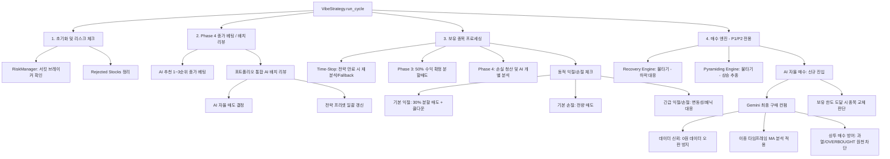

# 🌲 KIS-Vibe-Trader Logic Tree & Checklist

이 문서는 KIS-Vibe-Trader의 핵심 비즈니스 로직을 트리 구조로 정리하고, 리팩토링 시 기능 누락을 방지하기 위한 점검 체크리스트를 제공합니다.

## 1. Core Trading Logic Tree

---

## 2. Refactoring Verification Checklist

### ✅ [A] 매도 (Exit) 로직
- [ ] **익절 (TP)**: 설정된 TP 도달 시 30% 분할 매도가 정상 작동하는가?
- [ ] **손절 (SL)**: 설정된 SL 도달 시 전량 매도가 정상 작동하는가?
- [ ] **익절 쿨다운**: 익절 후 1시간 동안 추가 익절이 제한되는가? (불타기 시 리셋 확인)
- [ ] **긴급 바이패스**: 급등(+3.0%) 또는 거래량 폭발 시 쿨다운을 무시하고 익절하는가?
- [ ] **물타기 유예**: 물타기 직후 30분간 손절이 유예되는가? (긴급 조건 시 즉시 실행 확인)
- [ ] **AI 자율 매도**: AI가 SELL 판정 시 TP/SL 도달 전이라도 선제 매도하는가?
- [ ] **매도 보호**: 매수 후 1시간 이내 종목은 AI 매도 권고를 차단하는가? (패닉 시 예외 확인)

### ✅ [B] 시장 페이즈 (Market Phase) 보정
- [ ] **Phase 1 (OFFENSIVE)**: 익절 +2%, 손절 -1% 보정이 적용되는가?
- [ ] **Phase 2 (CONVERGENCE)**: 익절 -1%, 손절 -1% 보수적 보정이 적용되는가?
- [ ] **Phase 3 (CONCLUSION)**: 수익권 종목 50% 분할 매도 및 본전(+0.2%) 스탑 설정이 작동하는가?
- [ ] **Phase 4 (PREPARATION)**:
    - [ ] **배치 리뷰**: 전 종목 일괄 AI 진단 및 전략 갱신/청산이 수행되는가?
    - [ ] **종가 베팅**: 1~3순위 종목 중 미보유 종목 매수 또는 기보유 종목 보호가 작동하는가?
    - [ ] **손실 청산**: 수익률 < 0인 종목에 대해 당일 매수 보호(1시간) 제외하고 청산되는가?

### ✅ [C] 매수 (Entry) 로직
- [ ] **물타기 (Recovery)**: SL+1.0% 구간에서 작동하며, 직전가 대비 -2% 하락 시에만 집행되는가?
- [ ] **불타기 (Pyramiding)**: TP-1.0% 이하로 트리거가 제한되며, 직전가 대비 +2% 상승 시 집행되는가?
- [ ] **AI 자율 매수**: 
    - [ ] **컨펌**: Gemini가 최종 'YES'일 때만 매수하는가? (0원 오판 방지 포함)
    - [ ] **상투 방어 (Bull Market)**: 상승장에서 모멘텀 가점을 +4%로 제한하고 초과 시 삭감하여 고점 추격 매수를 방지하는가?
    - [ ] **과열/눌림목 제어**: 분봉 20MA 기준 `OVERBOUGHT` 시 기계적으로 매수 차단하고, `BUY_ZONE` 시 가점을 부여하는가?
    - [ ] **교체**: 최대 보유 한도 도달 시 기존 종목과 비교하여 교체 매매를 수행하는가?
    - [ ] **핑퐁 방지**: 익절/손절 후 2시간 이내 재진입이 금지되는가?
- [ ] **현금 비중 (Cash Safety)**: 하락장(30%) / 방어모드(80%) 최소 현금 비중 원칙이 지켜지는가?

### ✅ [D] 인프라 및 기타
- [ ] **영속성 (Persistence)**: 매매 발생 시 `trading_state.json`에 즉시 반영되는가?
- [ ] **API 안정성**: 5초 1종목 제한 및 KIS API Rate Limit 준수가 보장되는가?
- [ ] **Fallback**: AI 장애 시 알고리즘 모드(기본 TP/SL)로 자동 전환되는가?
- [ ] **TUI 가시화**: VIBE 상태, DEMA 지표, AI 분석 결과가 실시간으로 표기되는가?

---

## 3. Current Branch Inspection Report (2026-04-29)

- **대상 브랜치**: current
- **점검 결과**: 
    - [x] Phase 4 통합 배치 리뷰 로직 (구현됨)
    - [x] AI 자율 매도 및 타이트닝 (구현됨)
    - [x] 종목 교체 매매 (구현됨)
    - [x] 0원 데이터 오판 방지 (구현됨)
    - [x] MA 이중 분석 및 AI 점수 보정 (구현됨)
- **특이사항**: `ExecutionMixin.run_cycle` 내에서 Phase 4 로직이 순차적으로 잘 배치되어 있음.
