# 🌲 KIS-Vibe-Trader Logic Tree & Checklist (Advanced for Testing)

이 문서는 시스템의 모든 기능 단위(자동/수동)를 정의하고, 테스트 코드가 커버해야 할 특정 조건과 트리거를 상세히 기술합니다.

## 1. System Architecture & Flow Tree

```mermaid
graph TD
    %% [Core Flow]
    Main[VibeStrategy.run_cycle] --> Init[1. 초기화 및 환경 진단]
    Init --> MarketStat[MarketAnalyzer: 시장 개장/휴장/패닉 여부 진단]
    Init --> VibeDetect[MarketAnalyzer: VIBE 판정 - Bull/Bear/Defensive]
    Init --> RiskCheck[RiskManager: 서킷 브레이커 및 현금 비중 체크]

    %% [Command & UI Units - Manual Control]
    Main --> UI_Command[2. 사용자 커맨드 처리 - TUI Key Input]
    UI_Command --> Reports[조회 리포트: B/D/H/P/A/L]
    UI_Command --> Manual_Trade[직접 매매: 1-매도 / 2-매수]
    UI_Command --> Manual_Config[임계치 수정: 3-TP/SL 수정]
    UI_Command --> Engine_Config[엔진 설정: 4-AI / 5-물타기 / 6-불타기]
    UI_Command --> AI_Manual[AI 수동 제어: 8-즉시 분석 / 9-전략 할당 / 7-종목 분석]
    UI_Command --> Sys_Config[시스템 설정: S-환경설정 / U-업데이트 / Q-종료]

    %% [Holding Management]
    Main --> HoldingProc[3. 보유 종목 프로세싱 - ExitManager]
    HoldingProc --> PhaseCorrection[Phase별 TP/SL 보정 - P1/P2]
    HoldingProc --> DynamicExit[실시간 익절/손절 감시]
    DynamicExit --> EmergencyExit[긴급 탈출: 패닉/Defensive 전환/급락]
    DynamicExit --> PartialExit[수익 확정: 분할 매도 및 쿨다운]
    HoldingProc --> Phase4_Exit[Phase 4: 장 마감 전 AI 통합 배치 리뷰/정리]

    %% [Entry Engine]
    Main --> EntryEngine[4. 매수 엔진 - EntryManager]
    EntryEngine --> AI_Buy[AI 자율 매수: 신규 진입]
    AI_Buy --> AI_Confirm[Gemini 최종 컨펌: 상투 방어/과열 체크]
    EntryEngine --> Recovery[Recovery Engine: 물타기 - 하락 대응]
    EntryEngine --> Pyramiding[Pyramiding Engine: 불타기 - 상승 추종]

    %% [Infrastructure]
    Main --> Infra[5. 인프라 및 상태 저장]
    Infra --> StateSync[영속성: trading_state.json 실시간 동기화]
    Infra --> DataReliability[데이터 신뢰: MA 3중 백업 및 소스 트래킹]
```

---

## 2. Functional Unit & Test Case Checklist

### ✅ [A] 수동 설정 및 제어 (Manual Commands)
- [ ] **1/2 (매도/매수)**: 번호/코드 입력 시 지정된 수량과 가격(또는 시장가)으로 즉시 주문이 나가는가?
- [ ] **3 (TP/SL 수정)**: 개별 종목 또는 기본 전략의 익절/손절선 변경이 즉시 반영되는가?
- [ ] **4/5/6 (엔진 설정)**: AI매수, 물타기, 불타기 엔진의 금액/한도/자동모드 변경이 즉시 영속 저장되는가?
- [ ] **8 (즉시 분석)**: 타이머와 무관하게 AI 시황 및 종목 분석이 즉시 실행되는가?
- [ ] **9 (전략 할당)**: 특정 종목에 전략 프리셋(예: 05-추세추종)을 수동 할당 시 TP/SL이 갱신되는가?
- [ ] **7 (심층 분석)**: 입력한 종목 코드에 대한 3D 분석 리포트가 생성되는가?

### ✅ [B] 시장 진단 및 리스크 (Market & Risk)
- [ ] **VIBE 판정**: 지수 DEMA(20) 위치 및 당일 등락률에 따른 Bull/Bear/Defensive 정확도.
- [ ] **글로벌 패닉**: 미지수 -1.5% 시 `is_panic` 활성화 및 모든 매수 차단.
- [ ] **현금 비중**: Bear(30%) / Defensive(80%) 상황에서 매수 집행 거절 확인.

### ✅ [C] 매도 로직 및 긴급 대응 (Exit Strategy)
- [ ] **VIBE 보정**: Bull(+3%/-1%), Bear(-2%/-2%), Defensive(-3%/-3%) 보정치 적용.
- [ ] **익절 쿨다운**: 분할 익절 후 1시간 제한 (불타기/수동 매수 시 리셋 확인).
- [ ] **긴급 바이패스**: 수익률 ≥ TP + 3.0% 또는 거래량 폭발 시 즉시 전량 익절.

### ✅ [D] 매수 엔진 및 교체 (Entry Strategy)
- [ ] **상투 방어**: 상승장 등락률 가점 제한(+4% Cap) 및 `OVERBOUGHT`(20MA +3%) 차단.
- [ ] **종목 교체**: 15점 이상 우위 및 기존 종목 30분 보유 조건 충족 시에만 집행.
- [ ] **물타기/불타기**: 트리거 조건(수익률, 평단 대비 위치) 및 현금 비중 체크.

### ✅ [E] 상태 관리 및 영속성 (State Management)
- [ ] **State Sync**: 모든 수동 설정(1~9번 커맨드 결과)이 `trading_state.json`에 즉시 기록되는가?
- [ ] **데이터 Fallback**: KIS 실패 시 Naver XML/JSON 백업 소스 작동 확인.

---

## 3. Test Condition Matrix (Edge Cases)

| 대상 로직 | 발동 조건 (Input) | 기대 결과 (Output) |
| :--- | :--- | :--- |
| **수동 전략 할당(9)** | 프리셋 03 적용, 수익률 +2.5% | **익절 실행** (03 프리셋 TP 도달 시) |
| **설정 변경(4, 5, 6)** | 자동모드 OFF 설정 후 조건 충족 | **매매 스킵** (Manual Mode 유지) |
| **수동 매수(2)** | 비보유 종목 수동 매수 집행 | **매수 후 AI 전략 자동 할당** 확인 |
| **기본 전략 수정(3)** | 기본 TP를 +5%에서 +10%로 수정 | **미지정 종목 전체 TP 상향** 반영 |
| **즉시 분석(8)** | 분석 실행 중 재실행 시도 | **중복 실행 차단** (is_analyzing 체크) |

---

## 4. Current Branch Status (2026-05-06)
- **업데이트**: 숫자 커맨드(1~6, 8, 9) 전체 로직 트리 통합 완료.
- **다음 단계**: 수동 설정 변경에 따른 자동 매매 엔진의 반응성 검증 테스트 구현.
