# 🌲 AI-Vibe-Trader Logic Tree & Checklist (v2.0.260515)

이 문서는 시스템의 모든 기능 단위(자동/수동)를 정의하고, Docstring 기반의 표준 명세와 테스트 코드가 커버해야 할 특정 조건을 기술합니다.

## 1. System Architecture & Flow Tree

```mermaid
graph TD
    %% [Core Flow]
    Main[VibeStrategy.run_cycle] --> Init[1. 초기화 및 환경 진단]
    Init --> MarketStat[MarketAnalyzer: 시장 개장/휴장/패닉 여부 진단]
    Init --> VibeDetect[MarketAnalyzer: VIBE 판정 - Bull/Bear/Defensive]
    Init --> RiskCheck[RiskManager: 서킷 브레이커 및 현금 비중 체크]

    %% [Command & UI Units - Manual Control]
    Main --> UI_Command[2. 사용자 커맨드 처리 - Interaction]
    UI_Command --> Reports[조회 리포트: B/D/H/P/A/L]
    UI_Command --> Manual_Trade[직접 매매: 1-매도 / 2-매수]
    UI_Command --> Manual_Config[임계치 수정: 3-TP/SL 수정]
    UI_Command --> Engine_Config[엔진 설정: 4-AI / 5-물타기 / 6-불타기]
    UI_Command --> AI_Manual[AI 수동 제어: 8-즉시 분석 / 9-전략 할당 / 7-종목 분석]

    %% [Holding Management]
    Main --> HoldingProc[3. 보유 종목 프로세싱 - ExitManager]
    HoldingProc --> PhaseCorrection[Phase별 TP/SL 보정 - P1~P4]
    HoldingProc --> DynamicExit[실시간 익절/손절 감시]
    DynamicExit --> EmergencyExit[긴급 탈출: 패닉/Defensive 전환/급락]
    DynamicExit --> PartialExit[수익 확정: 분할 매도 및 쿨다운]
    HoldingProc --> Phase4_Exit[Phase 4: 장 마감 전 AI 통합 배치 리뷰/정리]

    %% [Entry Engine]
    Main --> EntryEngine[4. 매수 엔진 - Entry/Recovery/Pyramiding]
    EntryEngine --> AI_Buy[AI 자율 매수: 신규 진입/종목 교체]
    AI_Buy --> AI_Confirm[VibeAlphaEngine: 상투 방어/BUY_ZONE 체크]
    EntryEngine --> Recovery[Recovery Engine: 물타기 - 하락 대응]
    EntryEngine --> Pyramiding[Pyramiding Engine: 불타기 - 상승 추종]

    %% [Infrastructure]
    Main --> Infra[5. 인프라 및 로깅]
    Infra --> RateLimiter[BaseAPI: 중앙 집중식 Token Bucket Rate Limiting]
    Infra --> StateSync[DataManager: trading_state.json 실시간 동기화]
    Infra --> PnLSync[SyncWorker: 보유 종목 전수 합산 기반 일일 평가액 보정]
    Infra --> Logger[TradingLogManager: JSON/텍스트 로그 및 텔레그램 알림]
```

---

## 2. Functional Unit Specification (Docstring Based)

### 🛰️ Market Analyzer & Risk Manager
- **장세 판단**: KOSPI/KOSDAQ 지수와 DEMA(20)의 이격도를 분석하여 Bull/Bear/Defensive 판정.
- **패닉 차단**: 글로벌 지수(NASDAQ 등) 급락 시 `is_panic=True`로 모든 신규 매수 원천 차단.
- **현금 보호**: Vibe별 최소 현금 비중(Bear 30%, Defensive 80%) 미달 시 매수 엔진 비활성화.
- **멀티 브로커 [v2.0]**: KIS 및 Kiwoom API 통합 지원. 중앙 집중식 Rate Limiter를 통한 API 안정성 확보.

### 🛡️ Exit Manager (Exit Strategy)
- **가변 임계치**: Vibe와 Phase(P1~P4)를 결합하여 실시간 TP/SL 보정.
- **수동 매수 보호 [v1.6.8]**: 사용자가 직접 매수한 종목은 20분 동안 AI 자율 분석에 의한 청산에서 보호됨. (단, 손절선 돌파 시에는 즉시 매도)
- **쿨다운 관리**: 익절 후 1시간 동안 재익절 제한 (불타기 시 리셋).
- **긴급 청산**: 수익률이 보정된 TP보다 3% 이상 높거나 거래량 폭발 시 즉시 탈출.

### 🚀 Entry Engines (AI/Recovery/Pyramiding)
- **VibeAlphaEngine**: 뉴스, 펀더멘털, 기술적 지표, **수급(스마트 머니) 사이클**을 결합한 100점 만점 퀀트 스코어링.
    - **수급 2중화 [v1.6.8]**: Naver(상세 이력) 우선 수집 후 KIS(연기금/실시간) 보완 체계로 데이터 신뢰도 극대화.
    - **[신규] AI 추천 필터 강화**: 시가총액 **1000억 미만** 초소형주 및 **ETF(레버리지/인버스 포함)**를 추천 후보군에서 원천 제외하여 개별 우량주 중심의 포트폴리오를 구성함.
    - **수급 사이클 가점 [v1.6.8]**: 단순 당일 매수가 아닌 최근 10일간의 '매집(Accumulation) -> 가속(Acceleration)' 사이클을 분석하여 상승 초입 종목 포착.
- **장 초반 안정화 필터 [v1.6.6]**: 09:00~09:20 구간 지수가 BULL이 아니면 AI 점수 커트라인 +15pt 상향 (노이즈 차단).
- **Recovery Engine**: 손절선 직전에서 평단가를 낮추는 물타기 로직. (직전 물타기 대비 -2% 조건)
- **Pyramiding Engine**: 상승 추세에서 비중을 확대하는 불타기 로직. (수익률 3% 이상 & 상승장)

---

## 3. Test Coverage (v2.0.260515)

### ✅ [T-01] 인프라 및 연결성 테스트
- [x] **`tests/test_kis_price.py`**: KIS 시세 조회 API 응답성 및 도메인 정합성 확인.
- [x] **`tests/test_kiwoom_api.py`**: Kiwoom REST API 인증 및 잔고 조회 확인.
- [x] **`tests/test_naver_api.py`**: 네이버 환율 및 지수 데이터 수집 확인.
- [x] **`tests/verify_gemini_api.py`**: 멀티 LLM(Gemini/Groq) 통신 및 모델 리스트 확인.

### ✅ [T-02] 데이터 수집 및 가공
- [x] **`tests/test_naver_ranking.py`**: 인기/거래량 종목 데이터 무결성 및 필터링 확인.

### ✅ [T-03] 핵심 로직 통합 테스트
- [x] **`tests/test_advanced_integration.py`**:
    - [x] 수동 매매 및 임계치 수정 시나리오.
    - [x] 물타기/불타기 트리거 및 현금 보호 로직.
    - [x] 장 마감(P3/P4) 수익 확정 및 AI 종목 교체 매매.
    - [x] 상투 매수 방어 및 0원 데이터 보호.

---

## 4. Maintenance Notes (2026-05-08)
- **문서화**: 전 모듈 Google 스타일 Docstring 적용 및 타입 힌트 표준화 완료.
- **로직 강화 [2026-05-08]**: 장 초반(09:00~09:20) 지수 Vibe 연동형 '안정화 필터' 도입으로 승률 최적화.
- **테스트**: KIS 랭킹 테스트를 시세 조회(`test_kis_price.py`)로 명확히 분리 및 통합 완료.
- **로직 강화 [2026-05-08]**: Defensive/BEAR 장세에서 손절선이 양수로 전환되어 조기 청산되는 버그를 방지하기 위한 **SL Guard (-1.0% 상한선)** 도입.
- **UI 최적화 [2026-05-08]**: AI 로그 및 추천 탭의 컬럼 너비 동적 확장 및 텍스트 생략(...) 로직 적용으로 시인성 개선.

---

## 5. NEXT_TASK (To-Do)
- [ ] **성능 최적화**: 멀티 브로커 동시 가동 시 자원 소모 최적화.
- [ ] **UI 고도화**: 지수 및 종목 차트 렌더링 품질 향상.

